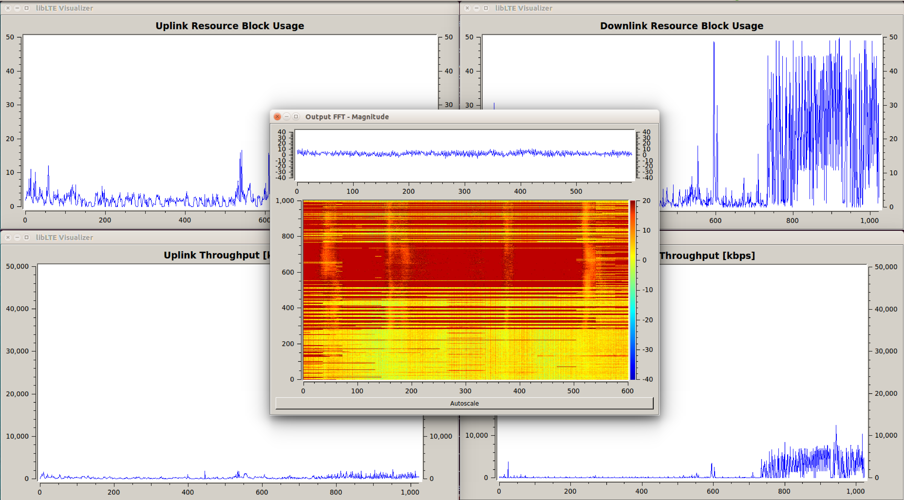

IMDEA-OWL
=========

OWL stands for Online Watcher of LTE. imdeaOWL is a free and open-source LTE control channel decoder developed by IMDEA Networks Institute and based on srsLTE, an LTE library for SDR UE and eNodeB developed by SRS (www.softwareradiosystems.com). OWL provides blind (oblivious of the terminal identity) decoding of DCI messages on LTE PDCCH.
OWL is built on srsLTE v1.3 (https://github.com/srsLTE/srsLTE) and inherits its modularity and main features. It is entirely written in C and, if available in the system, uses the acceleration library VOLK distributed in GNURadio. 


The OWL software license is AGPLv3.

New feature:
 * OWL now offers a graphical decoder showing: online spectrograph and average (per frame) downlink used resources and data rate. See guidelines below for more details.   

OWL specific features:
 * Compliant with DCI formats 0, 1, 1A, 1B, 1C, 1D, 2, 2A
 * Obtains C-RNTIs values from PRACH and using blind decoding verification
 * Maintains a list of active C-RNTIs for robustness and decoding speed
 * Provide means for control channel power analysis (without actual decoding)

OWL Missing Features: 
 * Carrier Aggregation
 * Semi-Persistent Scheduling
 * Uplink control channel decoding

srsLTE inherited Features: 
 * LTE Release 8 compliant
 * FDD configuration
 * Tested bandwidths: 1.4, 3, 5, 10, 15 and 20 MHz
 * Transmission mode 1 (single antenna) and 2 (transmit diversity) 
 * Cell search and synchronization procedure for the UE
 * All DL channels/signals are supported for UE and eNodeB side: PSS, SSS, PBCH, PCFICH, PHICH, PDCCH, PDSCH
 * All UL channels/signals are supported for UE side: PRACH, PUSCH, PUCCH, SRS 
 * Frequency-based ZF and MMSE equalizer
 * Highly optimized Turbo Decoder available in Intel SSE4.1/AVX (+100 Mbps) and standard C (+25 Mbps)
 * MATLAB and OCTAVE MEX library generation for many components
 * UE receiver tested and verified with Amarisoft LTE 100 eNodeB and commercial LTE networks (Telefonica Spain, Three.ie and Eircom in Ireland)

srsLTE Missing Features: 
 * Closed-loop power control 
 * Semi-Persistent Scheduling
 * Aperiodic CQI reports

Hardware
--------

The library currently supports the Ettus Universal Hardware Driver (UHD) and the bladeRF driver. Thus, any hardware supported by UHD or bladeRF can be used. There is no sampling rate conversion, therefore the hardware should support 30.72 MHz clock in order to work correctly with LTE sampling frequencies and decode signals from live LTE base stations. 

We have tested the following hardware: 
 * USRP B210
 * USRP X300
 * bladeRF

OWL installation and minimal use guide:
=======================================

OWL is built on the srsLTE library by Software Radio Systems. Thus, if you are already able to use srsLTE (at least pdsch_ue) OWL should run without many issues. However, this guide will give you the minimum set of information to install all the required software on a clean ubuntu 14.04+ installation. Also, this guide include steps for the preferable installation of the Nuand BladeRF software. OWL is also tested on USRP x310, but the guide for a correct installation of the related UHD library is to be done in the next release. 

Part 1 - Installation:
----------------------
- Install dependencies:

```sh
$ sudo apt-get install build-essential git cmake libboost-system-dev libboost-test-dev libboost-thread-dev libqwt-dev libqt4-dev libfftw3-dev
```

- BladeRF installation (skip this if you use USRP)

please refer to https://github.com/Nuand/bladeRF/wiki/Getting-Started%3A-Linux for a complete installation guide
To activate the release PPA, simply:
```sh
$ sudo add-apt-repository ppa:bladerf/bladerf
$ sudo apt-get update
$ sudo apt-get install bladerf libbladerf-dev bladerf-firmware-fx3 bladerf-fpga-hostedx40 
```

- Install srsgui 

This is not mandatory for OWL to work, but is a nice tool and it helps testing srsLTE and OWL:
```sh
$ git clone https://github.com/suttonpd/srsgui.git
$ cd srsgui
$ mkdir build
$ cd build
$ cmake ../
$ make
$ sudo make install
```

- Install gnuradio

only VOLK is needed, but the VOLK standalone installation usually fails and installing gnuradio in this way is usually fast and error-free. If you have problem with this, just try to have VOLK installed https://github.com/gnuradio/volk):
```sh
$ sudo apt-get install gnuradio
```

- Clone and install OWL

```sh
$ git clone https://git.networks.imdea.org/nicola_bui/imdeaowl.git
$ cd imdeaowl
$ mkdir build
$ cd build
$ cmake ../
$ make
```

If everything succeeded you will find OWL's executables together with srsLTE's examples in the srsLTE/build/srslte/examples folder.

Part 2 - Executable description:
--------------------------------

**Inherited from srsLTE**
- cell_search

Scan a given LTE band trying to acquire synchronization with the base station. Please, refer to this website for the used frequencies in your country 
http://www.spectrummonitoring.com/frequencies
cell_search requires the band number and can also use the EARFCN numbers to narrow the search, please refer to this website for details:
http://niviuk.free.fr/lte_band.php

- pdsch_ue

emulate a UE trying to connecting to a given frequency, first looking for synchronization and, then, decoding control messages related to broadcast transmissions.
In addition, this program provide some useful statistics about synchronization and decoding success rate.
TIP: once you have the frequency of a base station you can run
```sh
$ ./pdsch_ue -f <freq>
```
where &lt;freq> is the base station central frequency in hertz, i.e. 1.8 GHz can be given as 1800e6 or 1.8e9. If the synchronization is successfull, pdsch_ue will plot the constellations of the control channel and the shared downlink channel (only broadcast messages). If the signal is clean, you should be able to see a QPSK constellation in both diagrams. In addition, the amplitude and phase channel responses are plotted together with the PSS synchronization. The last one is ok if it looks like a gaussian.

**OWL files**

- imdea_capture_sync

This program capture a raw trace of the LTE channel synchronized on the beginning of the first subframe 0 detected. A very useful reference is http://www.sharetechnote.com/html/FrameStructure_DL.html
Usage: 
```sh
$ ./imdea_capture_sync -f <freq> -l <cell_num> -n <subframe_num> -o <output_filename>
```
&lt;freq> is the base station central frequency in hertz, i.e. 1.8 GHz can be given as 1800e6 or 1.8e9.
&lt;cell_num> is in {0,1,2} and can be obtained from cell_search or pdsch_ue (see for reference http://www.sharetechnote.com/html/Handbook_LTE_PCI.html)
&lt;subframe_num> is the number of subframes to be recorded in the trace. 1 subframe = 1 millisecond
&lt;output_filename> where to record the trace. The trace can be then used with the other programs for offline processing. 
TIP: putting -o /dev/null creates no output, but allows to test the signal synchronization without risking any buffer overrun (pc not ready when the sdr sends the streams). The output of the program is one line per frame (10 ms) and can be:
Decoded MIB ... (good)
MIB not decoded ... (noise on the channel)
sync loss (bad)

- imdea_cc_decoder

This program is the main part of OWL, where the control channel is decoded. It works both online and offline and pre-recorded traces.

Online usage:
```sh
$ ./imdea_cc_decoder -f <freq> -n <subframe_num> 1> <cc_out_filename> 2> /dev/null
```
&lt;cc_out_filename> specifies where to save the decoded control channel messages. If omitted, the messages are printed to the stdout. Don't forget to redirect the stderr (2> /dev/null), which is used to produce the list of location to be checked by the fine-tuner.
The output of the decoder is a tab separated list where each line represents a decoded message. The columns are as follows:
  1.	SFN: internal timing of LTE (1 every frame = 10 ms)
  2.	subframe index from 0 to 9 (1 subframe = 1 ms)
  3.	RNTI in decimal
  4.	Direction: 1 = downlink; 0 = uplink
  5.	MCS in 0 - 31
  6.	number of allocated resource blocks in 0 - 110
  7.	transport block size in bits
  8.	transport block size in bits (code word 0), -1 if n/a
  9.	transport block size in bits (code word 1), -1 if n/a
  10.	DCI message type. This version only scans for 0 (format 0), 2 (format 1a), 6 (format 2a)
  11.	new data indicator toggle for codeword 0
  12.	new data indicator toggle for codeword 1
  13.	HARQ process id
  14.	ncce location of the DCI message
  15.	aggregation level of the DCI message
  16.	CFI
  17.	DCI correctness check 

Offline usage:
```sh
$ ./imdea_cc_decoder -i <input_trace_filename> -l <cell_num> -c <pci> -P <ports> -p <prb> -z <rnti_out_filename> -Z <rnti_in_filename> 1> <cc_out_filename> 2> <cc_fix_filename>
```
&lt;input_trace_filename> a trace that you saved with imdea_capture_sync
&lt;pci> &lt;ports> &lt;prb> physical cell id, antenna ports and number of physical resourrce blocks of the LTE channel. All of these can be obtained using cell_search, pdsch_ue, imdea_capture_sync
&lt;rnti_in_filename> &lt;rnti_out_filename> are the rnti lists. They are optional; if not provided the tool generates a new list. If available it starts with the information given. The format is a vector of 65355 elements, which can be 0 (not used), 1 (used, but not used in the last 10 seconds), 2 (used in the last 10 seconds).
&lt;cc_fix_filename> output file for the fine_tuner program. It specify one location to be checked per line. The columns are as follows:
  1. SFN
  2. subframe
  3. ncce
  4. L
  5. CFI

- imdea_fine_tuner

offline tool to post_process recorded trace to try to decode DCI messages in location that could not be decoded by imdea_cc_decoder.
Usage:
```sh
$ ./imdea_fine_tuner -i <input_trace_filename> -l <cell_num> -c <pci> -P <ports> -p <prb> -z <cc_fix_filename> -Z <rnti_in_filename> 1> <cc_fixed_filename> 2> /dev/null
```

it can only be used after imdea_cc_decoder on the output produced. imdea_fine_tuner generate <cc_fixed_filename> with the same format of <cc_out_filename> (see above)

- imdea_cc_decoder_graph

This program is identical to imdea_cc_decoder, but in addition it displays five graphs:
1. a spectrograph of the received power
2. average downlink frame resource usage 
3. average downlink frame data rate
4. average uplink frame resource usage 
5. average uplink frame data rate

Online usage:
```sh
$ ./imdea_cc_decoder_graph -f <freq> &> /dev/null
```
Both stderr and stdout are redirected to /dev/null, because they will produce the same output as imdea_cc_decoder does. Below an example of the obtained graphs.



Part 3 - OWL setup and first use
--------------------------------

- Install everything correctly!
- Use a software defined radio capable of sampling at a LTE compliant sampling rate (30.72, 23.04, 15.36, 11.52).
- srsLTE and OWL are heavy on the I/O. Try not to have read/write operations at the same time (different buffers may interfer). If overruns are detected, consider working on ramdisk (see https://wiki.archlinux.org/index.php/Tmpfs)
- Use a good antenna, capable of LTE frequencies. Check the bands used in your country on http://www.spectrummonitoring.com/frequencies
- Use cell_search to get the central frequencies of the available cell in the surrounding
- Try to get a map of the base station location and put your sniffer in a location where a line of sight with the antenna is available
- Use pdsch_ue and imdea_capture_sync to assess the signal quality
- Once you have a good signal, you should have pdsch_ue showing very clean QPSK constellations and imdea_capture_sync showing almost only "Decoded MIB ..." output.
- At this point you should have &lt;freq> &lt;cell_num> &lt;pci> &lt;ports> &lt;prb>
- Try first the online decoder with the output on screen:

```sh
$ ./imdea_cc_decoder -f <freq> -n <subframe_num> 2> /dev/null
```

- Try a capture, with subsequent decoding and fine tuning:

```sh
$ ./imdea_capture_sync -f <freq> -l <cell_num> -n <subframe_num> -o <output_filename>
$ ./imdea_cc_decoder -i <input_trace_filename> -l <cell_num> -c <pci> -P <ports> -p <prb> -z <rnti_out_filename> -Z <rnti_in_filename> 1> <cc_out_filename> 2> <cc_fix_filename>
$ ./imdea_fine_tuner -i <input_trace_filename> -l <cell_num> -c <pci> -P <ports> -p <prb> -z <cc_fix_filename> -Z <rnti_in_filename> 1> <cc_fixed_filename> 2> /dev/null
$ sort -u <cc_out_filename> <cc_fixed_filename> -o <cc_total_filename> (to combine the output)
```

- You can also use the recorded trace to obtain a spectrogram of the LTE transmission (in a future release, I will provide matlab and octave scripts to do that as well).
- Have fun!

Acknowledgements
================

If you enjoyed using OWL, please acknowledge us in your publication(s) by referring to:

```tex
@inproceedings{bui2016owl,
  title={{OWL: a Reliable Online Watcher for LTE Control Channel Measurements}},
  author={Bui, Nicola and Widmer, Joerg},
  booktitle = {ACM All Things Cellular (MobiCom Workshop)},
  year = {2016},
  month = {Nov.},
  location = {New York, USA},
} 
